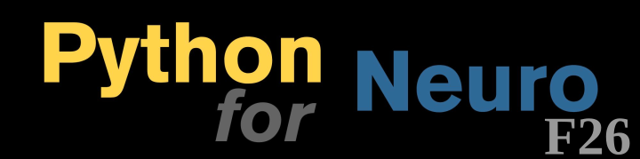

# Introduction to Python for Neuroscientists
Course repository for the Fall 2026 edition of Introduction to Python for Neuroscientists, run by the Columbia Neurobiology and Behavior PhD program.

Course description: This class will give students a general and applied introduction to Python within the context of neuroscience. Topics covered will include setting up python, using git to track and publicize work, programming basics, data manipulation and visualization, machine learning, and navigating existing codebases. The course will culminate in a project where students will analyze data of their choice in Python (options will be provided for students who don’t have their own datasets). Students will then work to understand each other’s projects to get experience reading and understanding each others’ code, and to incentivize good documentation. Students will present their work to the class.

Course Structure: Classes will consist of live programming and instruction, alongside optional out-of-class homework (see important dates below for details). Pair and group-programming will be used in addition to individual programming. Please bring your laptop – if you do not have one / that will be an issue, please contact us.

Prerequisites: No background in programming or math is required. All we ask is that you come with a desire to learn :)

Grades will be based on participation and the final project.

Email: pfncolumbia@gmail.com

Important dates:
* By 9/15: Watch pre-videos, setup computer, and make a github account following these [instructions].
* Weeks 6-7: set up a time if you want to discuss your project with us
<!-- * By 11/05: Submit 1-page project proposal -->
<!-- * Week 9: Meet with us to discuss project proposal if necessary. -->
<!-- * By 12/03: Submit project. -->
<!-- * 12/10: Presentations -->

Schedule (subject to change):
<table class="tg">
<thead>
  <tr>
    <th class="tg-fymr">Week</th>
    <th class="tg-fymr">Topic</th>
    <th class="tg-fymr">Lecturer</th>
    <th class="tg-fymr">Homework Due</th>
  </tr>
</thead>
<tbody>
  <tr>
    <td class="tg-0pky"><a href="https://github.com/Columbia-Neuropythonistas/IntroPythonForNeuroscientists2025/tree/main/Week01" target="_blank" rel="noopener noreferrer">Week 1</a> (9/2)</td>
    <td class="tg-0pky">Python Workflow: - Use python locally in VSCode in file form and as Jupyter Notebooks (hello world) - Set up conda environment - Git Basics – create a repo and commit to it</td>
    <td class="tg-0pky">Sharon</td>
    <td class="tg-0pky"><a href="https://github.com/Columbia-Neuropythonistas/IntroPythonForNeuroscientists2025/tree/main/Week01" target="_blank" rel="noopener noreferrer">HW0 (Submit on courseworks)</a></td>
  </tr>
  <tr>
    <td class="tg-0pky">Week 2 (9/9)</td>
    <td class="tg-0pky">Python Basics: - Why use python? - Data Types &amp; Variables (float, int, str, list, dict, tuple) - Booleans &amp; If/Else </td>
    <td class="tg-0pky">Sharon</td>
    <td class="tg-0pky"></td>
  </tr>
  <tr>
    <td class="tg-0pky">Week 3 (9/16)</td>
    <td class="tg-0pky">Python Basics: - Lists  - Dictionaries- Tuples  - For Loops  - List Comprehension  - Enumerate </td>
    <td class="tg-0pky">Sharon</td>
    <td class="tg-0pky"></td>
  </tr>
  <tr>
    <td class="tg-0pky">Week 4 (9/23)</td>
    <td class="tg-0pky">Python Basics:  - While Loops  - Functions  - return  - *args and **kwargs  - Errors - Try/Except 
    - Typehinting/Docstrings
    </td>
    <td class="tg-0pky">TBD</td>
    <td class="tg-0pky"></td>
  </tr>
  <tr>
    <td class="tg-0pky">Week 5 (9/30)</td>
    <td class="tg-0pky">Numpy:  - Why do we need numpy? - Basic numpy functionalty - How to manipulate and read out arrays - How to solve mathematical problems in Python.</td>
    <td class="tg-0pky">TBD</td>
    <td class="tg-0pky"><a href="https://github.com/Columbia-Neuropythonistas/IntroPythonForNeuroscientists2025/tree/main/Week04" target="_blank" rel="noopener noreferrer">HW4 (Submit on courseworks)</a></td>
  </tr>
  <tr>
    <td class="tg-0pky">Week 6 (10/7)</td>
    <td class="tg-0pky">TBD</td>
    <td class="tg-0pky"></td>
    <td class="tg-0pky"></td>
  </tr>
  <tr>
    <td class="tg-0pky">Week 7 (10/14)</td>
    <td class="tg-0pky">Pandas and Data Visualization: - Why is Pandas useful, and why do we need it for data science in Python? - How do we use Pandas to manipulate data? - How can we load and save data in pandas? - How can we plot basic data in Python? </td>
    <td class="tg-0pky">TBD</td>
    <td class="tg-0pky"></td>
  </tr>
  <tr>
    <td class="tg-0pky">Week 8 (10/21)</td>
    <td class="tg-0pky">Data Visualization and Object-oriented programming - How can we make more complicated plots in Python? - How can we use Seaborn to travers and plot large, complex datasets? - How do we use documentation to find solutions to programming questions and problems? - What is the basic structure of OOP in Python? - How do we read others' OOP code?</td>
    <td class="tg-0pky">TBD</td>
    <td class="tg-0pky"></td>
  </tr>
  <tr>
    <td class="tg-0pky">Week 9 (10/28)</td>
    <td class="tg-0pky">Navigating an expert codebase: - Given a problem/input and a desired output, how can we use existing resources to implement a solution? - Working through documentation and online resources to learn a package - Adapting prewritten pipelines to custom needs</td>
    <td class="tg-0pky">TBD</td>
    <td class="tg-0pky"><a href="https://github.com/Columbia-Neuropythonistas/IntroPythonForNeuroscientists2023/tree/main/Week08" target="_blank" rel="noopener noreferrer">HW8 (Submit on courseworks)</a></td>
  </tr>
  <tr>
    <td class="tg-0pky">Week 10 (11/4)</td>
    <td class="tg-0pky">TBD</td>
    <td class="tg-0pky"></td>
    <td class="tg-0pky"></td>
  </tr>
  <tr>
    <td class="tg-0pky">Week 11 (11/11)</td>
    <td class="tg-0pky">Machine learning</td>
    <td class="tg-0pky">Abhi</td>
    <td class="tg-0pky"></td>
  </tr>
  <tr>
    <td class="tg-0pky">Week 12 (11/18)</td>
    <td class="tg-0pky">Project Day</td>
    <td class="tg-0pky"></td>
  </tr>
  <tr>
    <td class="tg-0pky">TBD - Likely skip (11/25)</td>
    <td class="tg-0pky">Skip for Thanksgiving Day</td>
    <td class="tg-0pky"></td>
    <td class="tg-0pky"></td>
  </tr>
  <tr>
    <td class="tg-0pky">Week 13 (12/2)</td>
    <td class="tg-0pky">Understanding Day</td>
    <td class="tg-0pky"></td>
    <td class="tg-0pky"></td>
  </tr>

</tbody>
</table>

## Miscellaneous Resources
- Go beyond what we covered in Week 1 with Git, Command Line, Shell, Code Editors and more with [The Missing Semester of Your CS Education](https://missing.csail.mit.edu) from MIT
- [The Good Research Code Handbook by Patrick Mineault](https://goodresearch.dev) -- good principles for writing research code in a quick and enjoyable read. He also provides information about [good tools](https://goodresearch.dev/tools.html#) that are good to explore if you are coding regularly.
